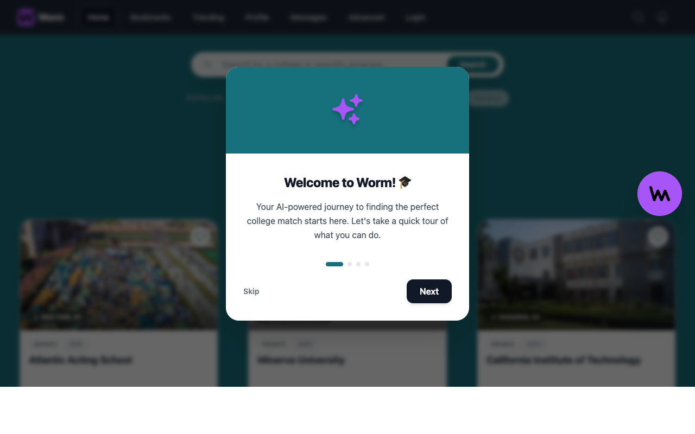

<div align="center">
  
  <h1>Worm</h1>
  <p><strong>Find your perfect college match with AI-driven insights and real student community.</strong></p>
  <p><a href="https://wormie.app" target="_blank"><strong>🚀 Live Application</strong></a></p>
</div>

---

## 🚀 What the App Does

**Worm** is a comprehensive, AI-powered higher education discovery platform designed to help prospective students and institutional representatives navigate the college admissions process. 

Instead of dealing with fragmented data across dozens of university websites, Worm aggregates official IPEDS (College Board) data into a single, beautifully designed dashboard. Users can discover colleges, apply advanced filters, bookmark their favorites, and interact dynamically with **Wormie**, a personalized AI Admissions Assistant running on Google's Gemini model.

It also features a built-in social network where students can join "College Hubs," ask questions, direct message peers, and even connect with verified admission officers.

---

## ✨ Features

- **🤖 Wormie AI Assistant:** A globally aware AI agent trained on your specific bookmarks and major preferences to give personalized admissions advice, calculate your chances, and even draft outreach emails to recruiters.
- **🔍 Advanced Data Discovery:** Search over 7,000 U.S. colleges with precise filters for tuition cost, SAT scores, acceptance rates, and institution type.
- **📊 Real Institutional Data:** Clean, easily readable data visualizations covering graduation rates, diversity, and maps.
- **bookmark Bookmarks & Smart Matches:** Save your favorite schools and let our recommendation engine find similar hidden gems based on your statistical profile.
- **💼 Proactive Recruiter Outreach:** A specialized feature set that allows verified college admissions staff to discover prospective students actively researching their institutions, enabling them to initiate highly-targeted, personalized direct messaging campaigns.
- **💬 Social Hubs & DMs:** Every college has a dedicated community hub for students to post questions, comment, and connect via direct messaging.

---

## 📸 Application Showcase



---

## 💻 Tech Stack

### Frontend
- **Framework:** React.js
- **Styling:** Vanilla CSS & TailwindCSS (for utility processing)
- **Deployment:** Firebase Hosting
- **Authentication:** Clerk Auth
- **Icons & UI:** Heroicons

### Backend
- **Framework:** Django & Django REST Framework (Python)
- **Database:** PostgreSQL
- **Deployment:** Google Cloud Run & Cloud SQL
- **AI Integration:** Google Gemini API (Semantic Vector Search & Chat)

---

## 🛠️ How to Run Locally

### 1. Clone the Repository
```bash
git clone https://github.com/bpaksoy/capstone.git
cd capstone
```

### 2. Backend Setup
You will need API keys for Google Gemini and Clerk Authentication.
```bash
cd backend
python3 -m venv venv
source venv/bin/activate

# Install dependencies
pip install -r requirements.txt

# Create a .env file and add your keys
echo "CLERK_SECRET_KEY=your_key_here" > .env
echo "GEMINI_API_KEY=your_key_here" >> .env

# Run migrations & start server
python manage.py makemigrations
python manage.py migrate
python manage.py runserver
```
*The backend API will run on `http://127.0.0.1:8000`.*

### 3. Frontend Setup
```bash
cd ../frontend

# Install node modules
npm install

# Start the React app
npm start
```
*The application UI will run on `http://localhost:3000`.*

---

## 🎯 Who is this for?

- **High School Students:** Navigating the stressful college application process and looking for data-driven answers and community support.
- **Guidance Counselors:** Tracking student preferences and discovering accessible, high-ROI institutions.
- **College Admissions Staff:** Finding prospective students who match their institution's statistical profile and initiating outreach.

---

## 🗺️ Roadmap / Planned Features

- [ ] **Application Tracker:** A kanban-style board to track submission deadlines, essays, and application statuses.
- [ ] **Mobile Application:** Porting the Responsive UI into a standalone React Native app.
- [ ] **Virtual Tours Integration:** Incorporating 360-degree video embeds for remote campus visits.
- [ ] **Alumni Verification:** A badge system to identify verified graduates providing advice in College Hubs.